## 1. THINGSBOARD:

ThingsBoard is an open-source Internet of Things (IoT) platform designed to facilitate device management, data collection, visualization, and analysis.

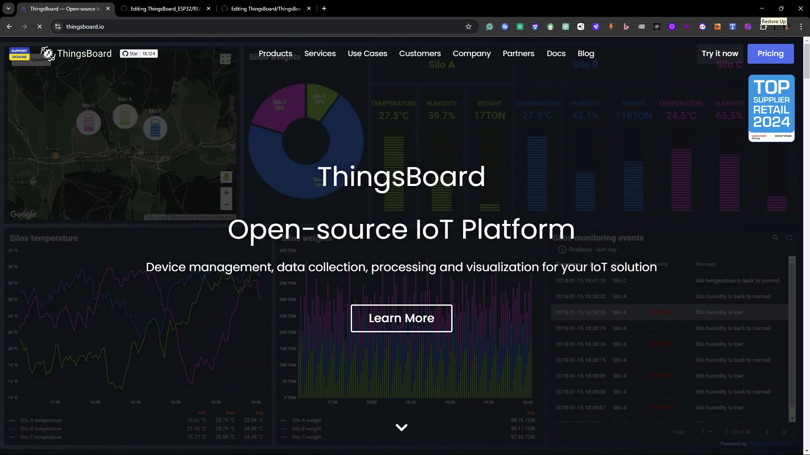

**1.1. Key Feature:**

* **Device Management:** Easily register and manage a wide variety of IoT devices.
* **Data Collection:** Supports multiple communication protocols (**`MQTT, HTTP, CoAP`**) for data ingestion.
* **Dashboards & Visualization:** Create customizable dashboards to visualize data in real-time using various widgets.
*	**Rule Engine:** Automate actions based on data conditions or triggers.
*	**User Management:** Role-based access to control user permissions.
*	**Deployment Options:**
    * **Self-Hosted:** The open-source version allows users to run their own instances.
    * **Cloud-Based:** The professional edition provides additional features and support in a hosted environment.
*	**Use Cases:** Ideal for applications in smart cities, industrial automation, environmental monitoring, and agriculture.

## 2. MQTT PROTOCOL WITH ESP32 THINGSBOARD:

**2.1.	Overview:**

MQTT (Message Queuing Telemetry Transport) is a lightweight messaging protocol suitable for IoT applications. ThingsBoard supports MQTT for real-time data transfer from devices such as the ESP32.

**2.2. Prerequisites:**

* **Hardware:**
  * ESP32 Development Board.
  * A DHT sensor (like DHT11 or DHT22) for temperature and humidity data (optional).
 
* **Software:**
  * [Arduino IDE](https://www.arduino.cc/en/software).
  * Libraries:
    * **`PubSubClient`** for MQTT.
    * **`DHT sensor library`** (if you are using a DHT sensor).

## 3. CREATE DEVICE ON THINGSBOARD:

For simplicity, we will provide the device manually using the UI.

   * Login to your ThingsBoard instance and navigate to the “**Entities**”. Then click the “**Devices**” page.

   

   * Click on the “`+`” icon in the top right corner of the table and then select “**Add new device**”.

   

   * Input device name. For example, “`SpaceBOT`”. No other changes required at this time. Click “**Add**” to add the device.

   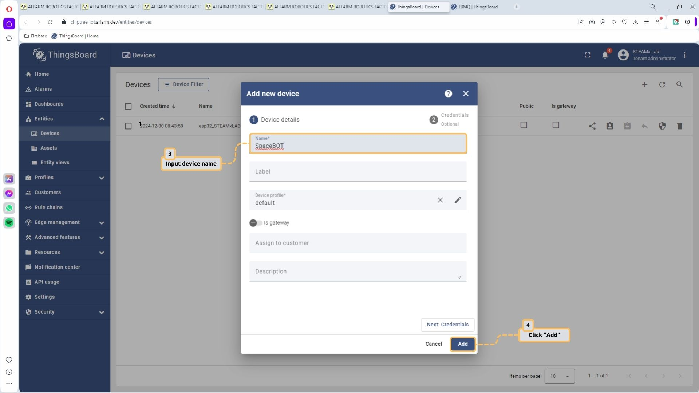

   * **Create Device:**
     * Go to **Devices** in ThingsBoard.
     * Click **Add a new device** and note the **Access Token**.
   * **Select Protocol:**
     * Click on the **MQTT** protocol tab after the device is created.
   * **Choose OS:**
     * Select your operating system (e.g., `Windows`).
   * **Skip Connectivity Check:**
     * Click **Close** to bypass the connectivity check for now.
    
   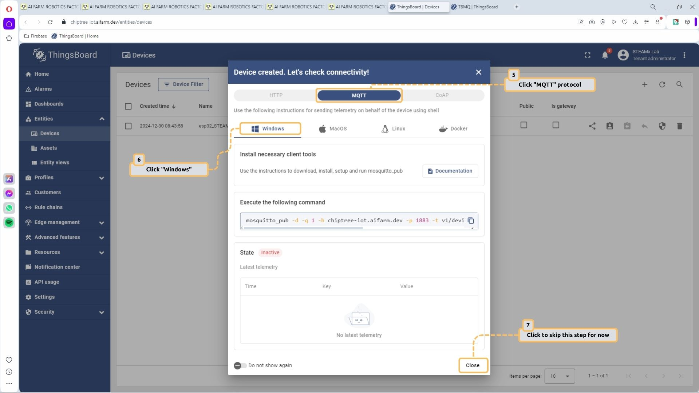

   * **Select Your Device:**
     * Click on your device name to open its details.
   * **Device State:**
     * Note that the device state is displayed as "**Inactive**" for the selected device.
    
   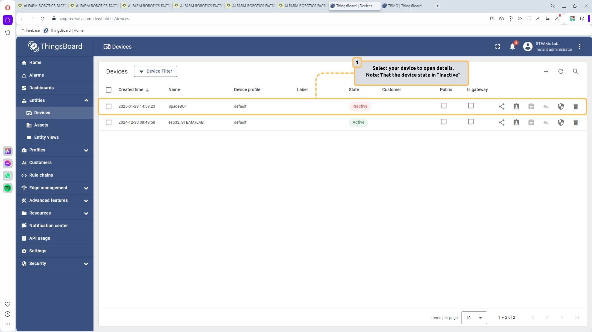

   * **Copy Access Token:**
     * **Action:** Click to copy the access token for your device.
   * **Copy Access Token:**
     * **Token Format:** Example access token shown(e.g., `cnqAlFb3p2UVhwp4uXa`).
    
   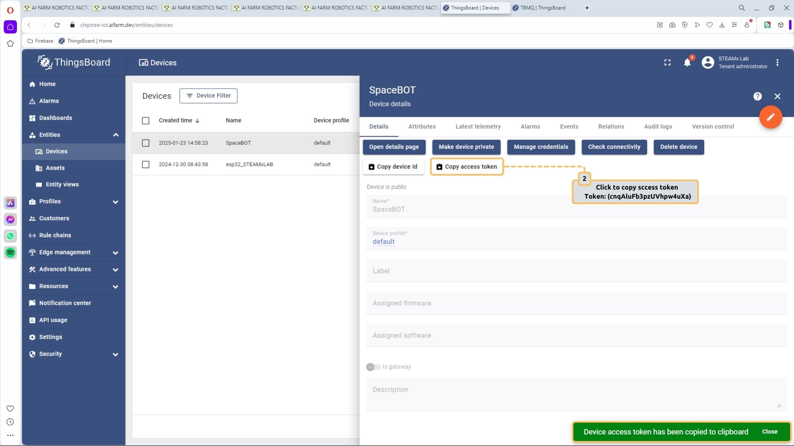

## 4. CONNECT WIFI:

   * **Connected to Wi-Fi:**
     * Indicates successful connection to the Wi-Fi network.
   * **Attempting MQTT Connection:**
     * Shows that the device is trying to establish an MQTT connection.
   * **Connection Status:**
     * Confirms that the MQTT connection has been established successfully.
    
   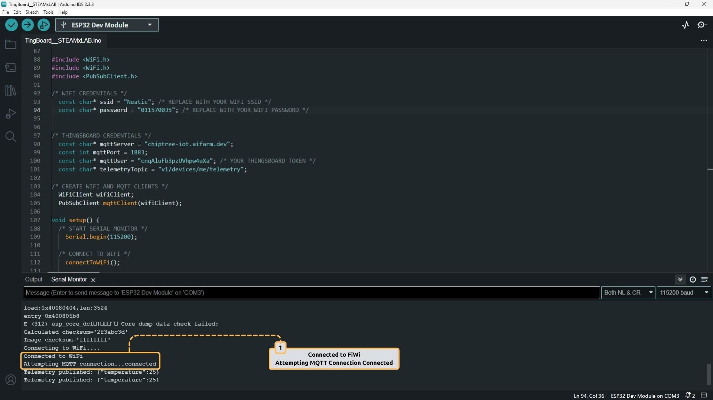

## 5. CONNECT WIFI:

   * **Device Name:**
     * **SpaceBOT:** Indicates the name of the selected device.
   * **State:**
     * **Active:** Shows the status of the device as "`Active`".
    
   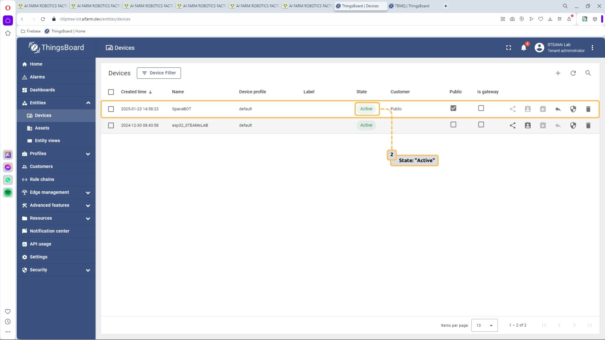

   * **Go to the "Dashboard" page:**
     * Access the dashboard section to view existing dashboards.
   * **Create New Dashboard:**
     * Access Option to create a new dashboard for monitoring and visualization.
   * **Import Dashboard:**
     * Option to import an existing dashboard into `ThingsBoard`.
    
   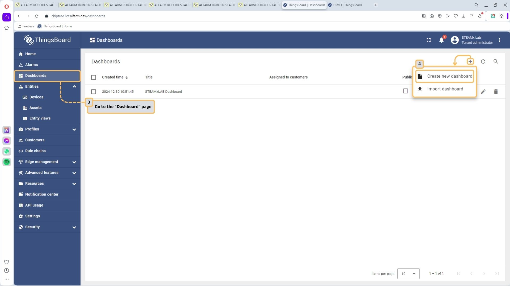

   * **Add Title: "`SpaceBOT`":**
     * Enter the title for your dashboard.
   * **Add Button:**
     * Click the button labelled "Add" to finalize the addition of the dashboard.
    
   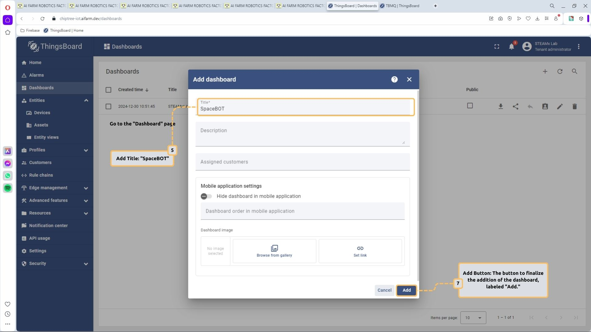

   * **Add Widget Button:**
     * Click "`Add widget`"
     * Function: Click this button to add a new widget to your dashboard.
    
   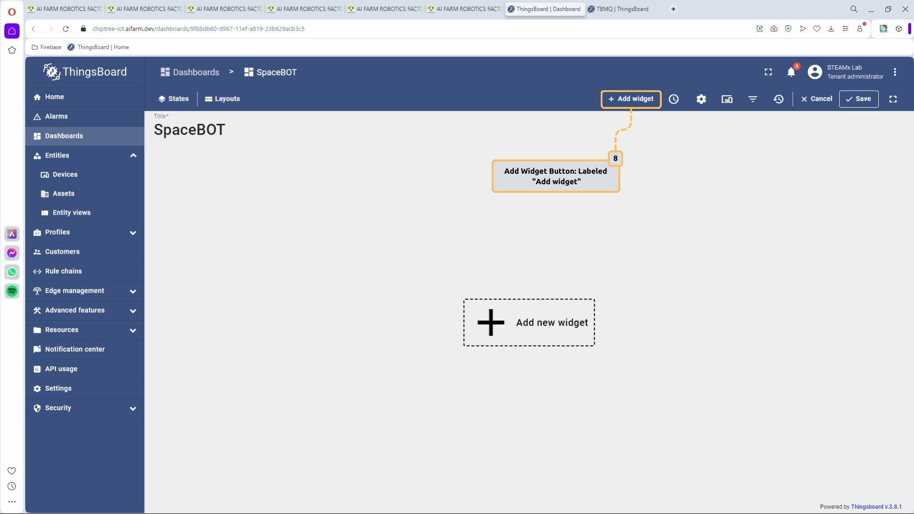

   * **Widgets Options Displayed:**
     * **Description:** Lists widget options available, including categories like Industrial widgets, Indoor Environment, Outdoor Environment, Liquid level, etc.

   

   * **Select "`Temperature`":**
     * Indicates the action to choose the "`Temperature`" widget from the available options.
    
   

   * **Select Device "`SpaceBOT`":**
     * Indicates the action to choose the device named "`SpaceBOT`" for the widget configuration.
    
   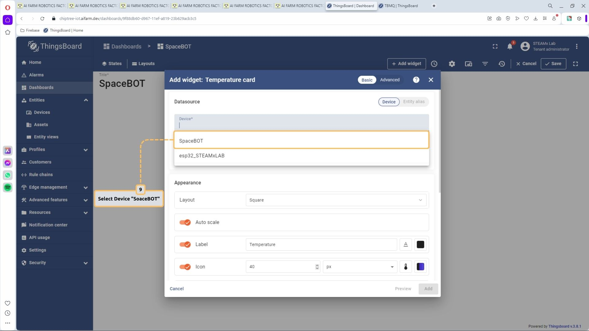

   * **Device "`SpaceBOT`":**
     * Indicates the selected device for the widget configuration.
   * **Data Key: "`temperature`"**
     * Specifies the data being pulled from the device.
    
   

   * **Input: "`temperature`"**
     * Indicates This is where you enter the data key.
   * **Save:**
     * To confirm the configuration changes.
    
   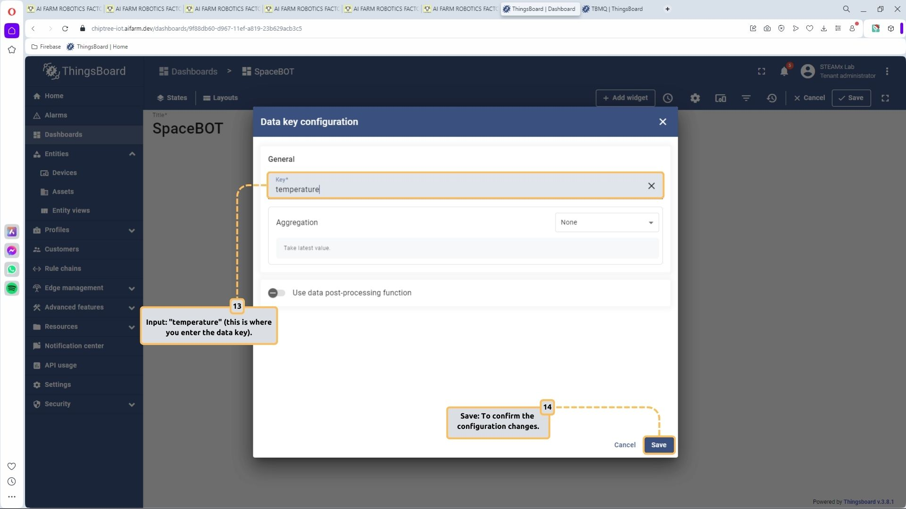

   * **Save Button:**
     * This indicates the "`Save`" button in ThingsBoard. It is used to save any changes made to the dashboard, widgets, or settings. The box mentions it is a "`prominent button to save your settings`," marked by a checkmark icon.
   * **Data Display:**
     * This points to the "`Data Display`" widget on the dashboard. It shows the label "`Temperature`" and its current value ("`25°C`"). This provides real-time data updates for the monitored entity (e.g., a sensor).
    
   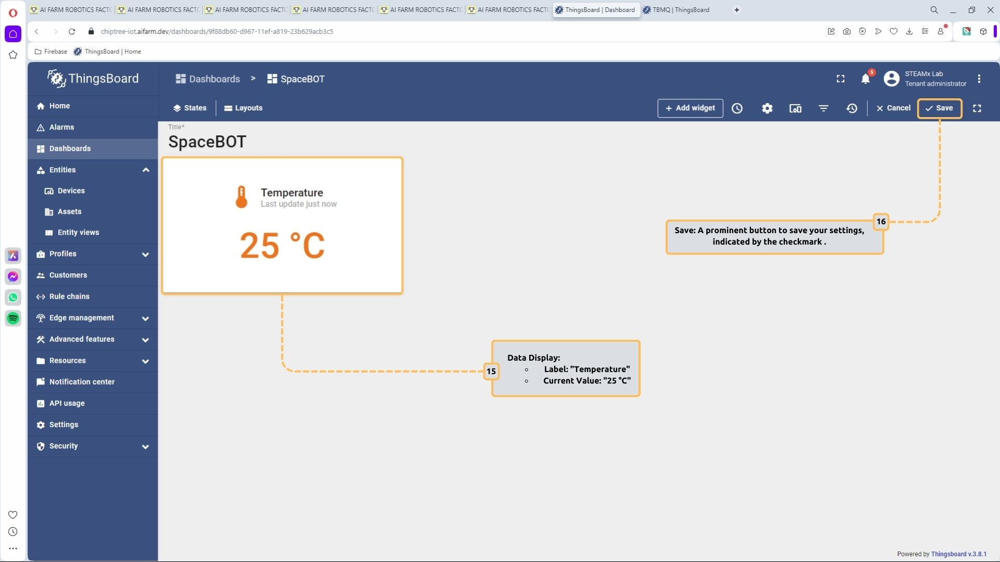

   * **Data Display in ThingsBoard:**
     * "`Data Display in ThingsBoard`", showing how it visually represents sensor data (like temperature) on the dashboard.

   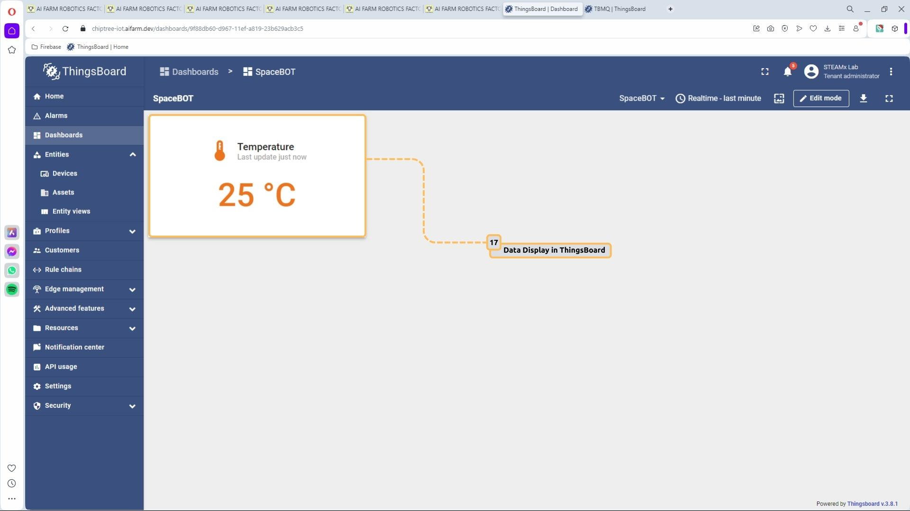

## 6. RESULT TESTING:

   * **Data Transmitter (Tx):**
     * The ESP32 module is transmitting temperature data ("temperature":25) to the MQTT server using ThingsBoard. The console confirms the successful publishing of telemetry data repeatedly.
   * **Data Receiver (Rx) and Display Value:**
     * The ThingsBoard dashboard is receiving the transmitted data and displaying it in real-time. The widget accurately reflects the temperature as `25°C`, confirming successful data communication and visualization.
    
   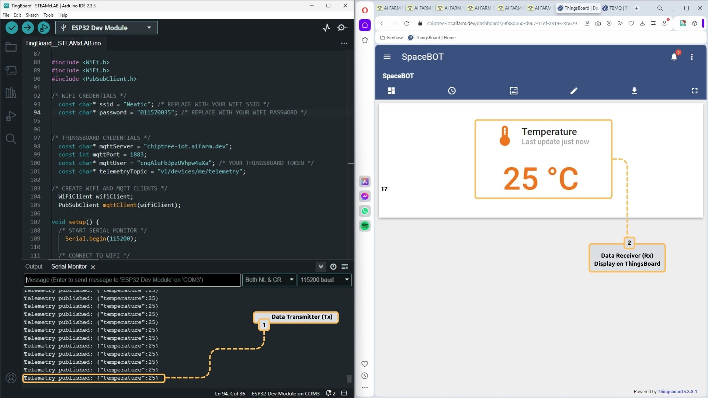
